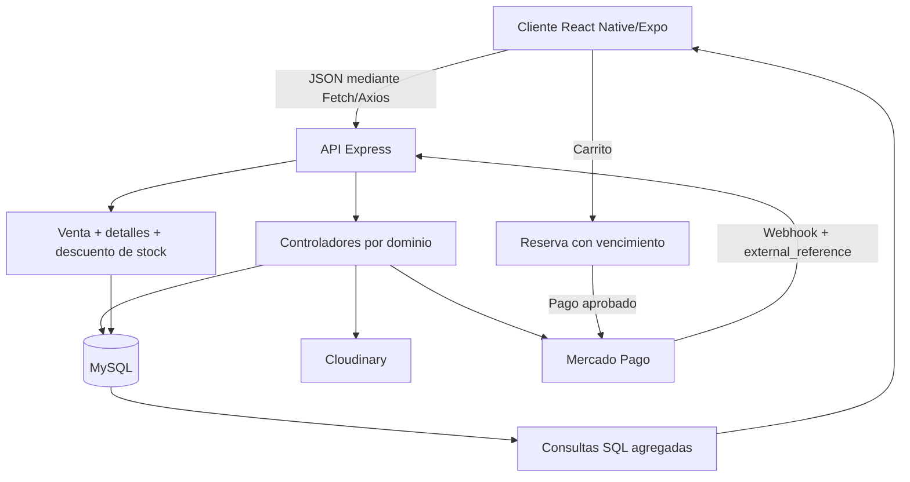

# Bites

> Marketplace de alimentos que gestiona catálogos, reservas, ventas y pagos en un flujo transaccional integrado. El sistema consolida inventario y operaciones comerciales para ofrecer trazabilidad de pedidos y reportes históricos por comercio.

| Ficha Técnica | Detalle |
| :--- | :--- |
| **Candidato / Rol** | Ingeniero de Backend & Persistencia |
| **Enfoque evaluado** | Modelado de datos, arquitectura backend e integración de servicios |
| **Stack de Persistencia** | MySQL, `mysql2/promise`, SQL parametrizado y pool de conexiones. No se observan ORM, migraciones versionadas ni cache |
| **Stack de Backend** | Node.js, Express, JavaScript ESM, dotenv, Mercado Pago, Cloudinary y XLSX |
| **Stack de Consumo (Front)** | React Native/Expo, ejecución web, Fetch API, Axios y Firebase Auth |
| **Repositorio / Código** | [github.com/tomasabrate/Bites](https://github.com/tomasabrate/Bites) |

---

## 1. Contexto Operativo y Flujo de Información

Bites permite que los comercios publiquen productos con precio, descuento, vencimiento, stock e imágenes. Los clientes consultan el catálogo, generan reservas o ventas, realizan pagos y reciben un código de retiro. Los comercios actualizan los estados de las ventas y consultan reportes mensuales e históricos.

El flujo principal combina persistencia transaccional, integración de pagos y consultas agregadas:

La composición de rutas y middlewares se encuentra en [`Backend/src/index.js`](C:/Users/Tomas%20Abrate/Documents/Repositorios/Bites/Backend/src/index.js) y [`Backend/src/app.js`](C:/Users/Tomas%20Abrate/Documents/Repositorios/Bites/Backend/src/app.js).

## 2. Ingeniería de Persistencia y Modelado de Datos

### Paradigma y motor

Se utiliza MySQL relacional mediante un pool de [`mysql2/promise`](C:/Users/Tomas%20Abrate/Documents/Repositorios/Bites/Backend/src/database/connection.js). La elección es adecuada para:

- relaciones entre clientes, comercios, productos y ventas;
- operaciones ACID sobre reservas, detalles y stock;
- consultas analíticas con `SUM`, `COUNT`, `GROUP BY`, `LEFT JOIN` y `COALESCE`;
- filtros por estado y fecha.

La conexión efectiva utiliza `MYSQL_URL`. Aunque [`Backend/src/config.js`](C:/Users/Tomas%20Abrate/Documents/Repositorios/Bites/Backend/src/config.js) declara variables individuales de base de datos, estas no se utilizan al crear el pool.

### Esquema central

El repositorio no incluye DDL ni migraciones; el modelo se reconstruye a partir de las consultas SQL:

- **`Comercios`**: `uid_comercio`, datos comerciales, `id_categoria`, coordenadas, imágenes, `activo` y credenciales de Mercado Pago. Se relaciona con productos, ventas y reseñas.
- **`Productos`**: `id_producto`, `uid_comercio`, categoría, nombre, precio, descuento, fechas, cantidad, imágenes y `activo`. Representa el inventario publicado.
- **`Ventas`**: `id_venta`, comercio, cliente, total, método de pago, código de retiro, fecha y estado. Es la cabecera de la operación.
- **`DetallesVenta`**: venta, producto, cantidad, precio unitario y subtotal. Conserva el precio histórico aplicado.

El flujo de pago incorpora `Reservas`, `DetalleReserva` y `Pagos`. `Resenas` implementa una relación cliente-comercio y utiliza `ON DUPLICATE KEY UPDATE`, lo que evidencia una unicidad esperada por par de usuarios.

### Integridad y acceso

- Las consultas reciben parámetros mediante `?`, evitando interpolación directa en la mayoría de los casos.
- `createReserva` inicia una transacción, inserta la reserva y sus detalles, confirma con `commit` y revierte con `rollback` ante errores.
- `postVenta` y `registrarVentaMP` insertan la venta, sus detalles y descuentan stock dentro de una transacción.
- El stock se valida antes de descontarse, pero no se observa `SELECT ... FOR UPDATE`, actualización condicional, constraint `CHECK` ni estrategia de idempotencia para webhooks.
- Se utilizan bajas lógicas mediante `activo = 0`, aunque también existen eliminaciones físicas.
- Los reportes generan los últimos seis meses, incluyendo meses sin ventas, y calculan productos más vendidos.
- No se observan índices declarados. Para producción serían relevantes índices sobre `uid_comercio`, `uid_cliente`, `id_venta`, `id_producto`, `fecha_venta`, `estado` y `payment_id`.

## 3. Arquitectura Backend y Lógica de Negocio

### Estructura del servidor

La arquitectura está organizada por rutas y controladores:

- **Rutas**: [`Backend/src/routes/`](C:/Users/Tomas%20Abrate/Documents/Repositorios/Bites/Backend/src/routes/) define los endpoints por recurso.
- **Controladores**: [`Backend/src/controllers/`](C:/Users/Tomas%20Abrate/Documents/Repositorios/Bites/Backend/src/controllers/) combina validación, reglas de negocio, SQL y respuestas HTTP.
- **Persistencia**: los controladores importan directamente el pool; no existe una capa Repository/DAO independiente ni inyección de dependencias formal.
- **Integraciones**: Cloudinary almacena imágenes; Mercado Pago gestiona preferencias, OAuth y webhooks; XLSX genera reportes.

### Procesamiento y validación

El backend recibe JSON, valida manualmente reglas esenciales y transforma los datos antes de persistirlos:

- rechaza carritos vacíos;
- exige que una venta contenga productos de un único comercio;
- verifica el stock disponible;
- calcula subtotales;
- serializa arrays de imágenes como texto separado por `;`;
- convierte agregados SQL a `Number` antes de responder;
- valida que una reserva solo pueda cancelarse si está en estado `pendiente`.

No se observan DTOs, JSON Schema, validación centralizada ni middleware backend visible para validar tokens de Firebase. La validación de payload es funcional, pero desigual entre endpoints.

### Rendimiento y estados

El endpoint de reseñas implementa paginación mediante `page`, `limit` y `OFFSET`, además de filtro por puntuación. Los listados de ventas, compras, reservas y pagos no tienen paginación. Los reportes agrupan por mes y producto, aunque el uso de `DATE_FORMAT(fecha_venta, '%Y-%m')` puede limitar el aprovechamiento de índices sobre fechas.

Los estados se distribuyen entre ventas, reservas y pagos (`EN CURSO`, `ENTREGADO`, `pendiente`, `finalizada`, `cancelada`). Existe lógica para cancelar reservas, pero no una máquina de estados centralizada ni validación completa de transiciones de venta. El job de limpieza de productos vencidos o agotados está implementado, pero comentado.

## 4. Capa de Integración (Contratos de API y Consumo)

### Contrato de intercambio

| Operación | Endpoint | Respuesta principal |
| :--- | :--- | :--- |
| Consultar catálogo | `GET /productos` | Array de productos activos con datos del comercio |
| Crear producto | `POST /productos` | `201` con el producto creado |
| Actualizar producto | `PUT /productos/:id_producto` | `200` con mensaje de confirmación |
| Crear reserva | `POST /reservas` | `201` con `id_reserva`, cliente y estado |
| Cancelar reserva | `PUT /reservas/:id_reserva/cancelar` | `200` con nuevo estado |
| Crear venta | `POST /ventas` | `201` con `id_venta` |
| Actualizar venta | `PUT /ventas/:id_venta` | `200` con mensaje de confirmación |
| Consultar detalles | `GET /ventas/:id_venta/detalles` | `{ detalles: [...] }` |
| Reporte por comercio | `GET /reportes/ventas/:uid_comercio` | Ventas mensuales y productos más vendidos |
| Histórico | `GET /reportes/ventas/historico/:uid_comercio` | Productos y unidades vendidas |
| Webhook de pago | `POST /mercado-pago/webhook` | `200 OK` o `500` ante error |
| Exportar reporte | `GET /reportes/excel/:uid_comercio` | Archivo XLSX |

Los servicios del cliente, como [`Frontend/services/productos.js`](C:/Users/Tomas%20Abrate/Documents/Repositorios/Bites/Frontend/services/productos.js), [`Frontend/services/ventas.js`](C:/Users/Tomas%20Abrate/Documents/Repositorios/Bites/Frontend/services/ventas.js) y [`Frontend/services/reservas.js`](C:/Users/Tomas%20Abrate/Documents/Repositorios/Bites/Frontend/services/reservas.js), centralizan las llamadas HTTP, serializan JSON, verifican `response.ok` y propagan errores.

### Consumo funcional en cliente

El frontend consulta productos, reservas, ventas y reportes para representar el estado operativo y los indicadores comerciales. [`Frontend/pages/Comercio/Reportes.jsx`](C:/Users/Tomas%20Abrate/Documents/Repositorios/Bites/Frontend/pages/Comercio/Reportes.jsx) consume los agregados de seis meses e histórico por comercio. La generación de archivos puede realizarse en backend o desde el cliente mediante [`Frontend/components/ExportarExcelButton.jsx`](C:/Users/Tomas%20Abrate/Documents/Repositorios/Bites/Frontend/components/ExportarExcelButton.jsx).

## 5. Mis Contribuciones Directas de Ingeniería

### Módulos bajo mi autoría

Como integrante del equipo principal, mi participación incluyó commits directos, pair programming, diseño de arquitectura y refactorización colaborativa en:

- diseño y evolución del modelo de clientes, comercios, categorías, productos, ventas, detalles, reservas, pagos y reseñas;
- implementación del acceso MySQL y controladores de productos, ventas, reservas, reportes y pagos;
- reglas de inventario: validación de carritos, control de comercio único, disponibilidad, subtotales y descuento de stock;
- flujo reserva → Mercado Pago → webhook → venta;
- endpoints REST y servicios de consumo para catálogo, operaciones comerciales y reportes;
- consultas agregadas de ventas mensuales, productos más vendidos e histórico;
- bajas lógicas y actualización de estados operativos.

La atribución contempla módulos commiteados por otros integrantes cuando fueron desarrollados mediante pair programming o refactorización colaborativa.

### Decisiones técnicas y trade-offs

- **MySQL frente a una base documental:** prioriza integridad referencial, transacciones y agregaciones; requiere versionar formalmente el esquema.
- **Precio unitario en `DetallesVenta`:** introduce redundancia controlada para conservar el precio histórico aunque cambie el producto.
- **Transacciones:** garantizan consistencia entre cabecera, detalle y stock; deben complementarse con bloqueo de filas e idempotencia bajo concurrencia.
- **Baja lógica:** preserva referencias históricas, pero debe aplicarse de forma consistente frente a eliminaciones físicas.
- **Reportes calculados bajo demanda:** simplifican la arquitectura y mantienen datos frescos; requieren índices, paginación o materialización si crece el volumen.
- **Imágenes externas:** reducen el tamaño de MySQL, aunque el almacenamiento como texto delimitado podría evolucionar a una tabla normalizada de imágenes.

El resultado es un backend funcional con persistencia transaccional, integración de pagos, control de inventario y una capa de reportes orientada a la toma de decisiones operativas.
